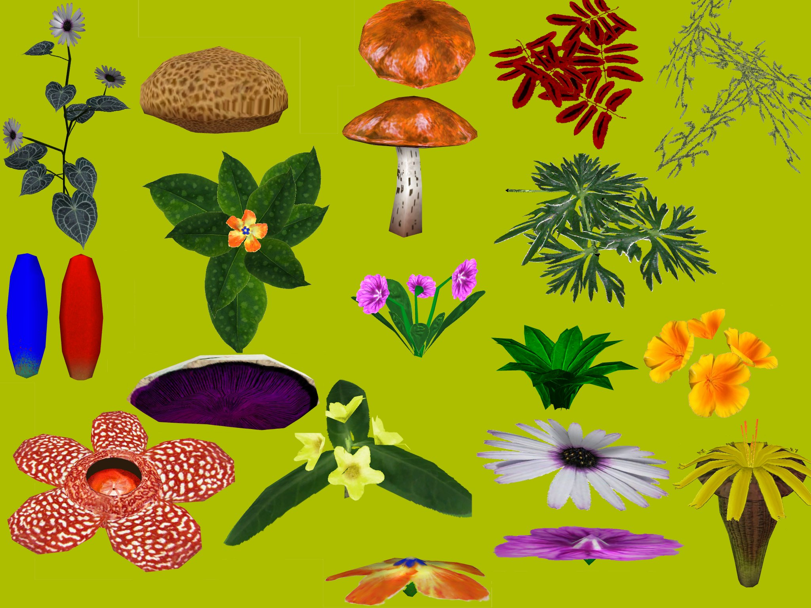
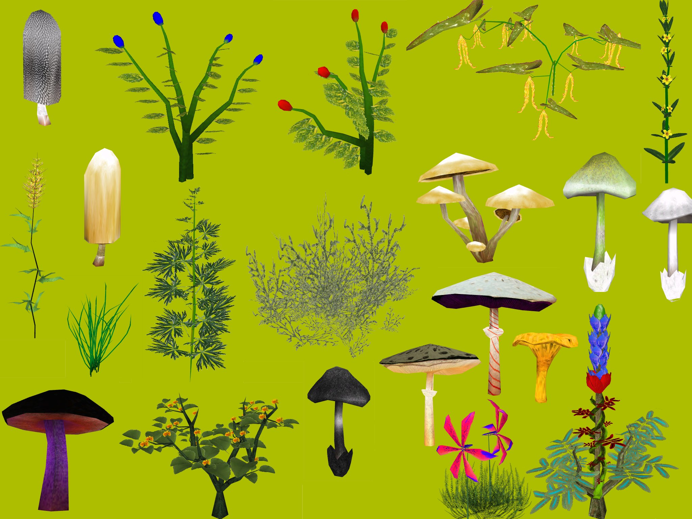

# Readme for sinHHHans Plant Resource




## Summary

- Game: TES IV - Oblivion
- Name of Ressource: sinHHHans Plant Ressource
- Version: 1.1
- Release-Date: June 2009
- Author: sinHHHans

## Details:

This ressource contains 29 new plant meshes, their textures, meshes for the Ingredient Items and their Inventory Icons.

Important: Most of the plants have a harvesting animation. This means that when the player harvests, e.g., the leaves of the plant, the leaves actually disapear ingame until they regrow. These can be activated via scripts, simply put one of these scripts on the plant:

For flowers and bushes:

```
scn PflanzenErnteSkript
Begin OnActivate
playgroup forward 1
activate
End

Begin OnReset
playgroup backward 1
End
```

For Mushrooms:

```
scn PilzErnteSkript

Begin OnActivate
activate
disable
End

Begin OnReset
enable
End
```

### Note on Ingredients
Some plants have regular seeds as ingredient which already exist in Oblivion.

### Note on Names
The names of textures, folders and meshes are mostly in German, but i guess it should be no problem.


### Used Tools
- Blender
- DXTBmp
- NIFSkope
- Paint Shop Pro
- TES Construction Set
- xNormal
- Ei der Zeit Readme Generator


### Credits
- Bethesda for the TES-Games and the Construction Set

